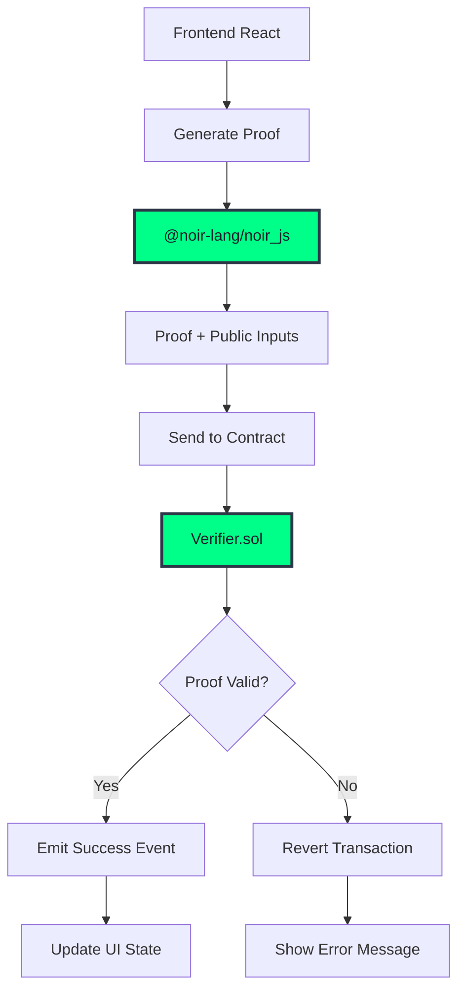

# 🏗️ Arquitecturas Ganadoras - Hackathons ZK

## ¿Por qué necesitas arquitecturas probadas?

En hackathons **no hay tiempo para arquitecturas experimentales**. Los equipos ganadores usan patrones probados que funcionan bajo presión. Aquí tienes **arquitecturas de proyectos que realmente ganaron** hackathons ZK importantes.

**¿Por qué funcionan estas arquitecturas en hackathons?**

- **Speed**: Patrones predefinidos = no perder tiempo decidiendo estructura
- **Debugging**: Separación clara = encontrar bugs más rápido bajo presión
- **Scalability**: Agregar features sin romper lo que ya funciona
- **Demo-ready**: Estructura que permite mostrar funcionalidad fácilmente

**¿Cuándo usar estas arquitecturas?**

- ✅ **Hackathons ZK de 48-72 horas**  
- ✅ **Proyectos que necesitan frontend + circuits + backend**  
- ✅ **Equipos de 2-4 personas trabajando en paralelo**  
- ✅ **Demos que deben funcionar sin fallos**

## Capas sugeridas

### **UI Layer**
- React/Next.js frontend
- Wallet connection (MetaMask, WalletConnect)
- Proof generation en cliente

### **Gateway Layer (Verifier)**  
- Smart contracts con verifier integrado
- Validación de proofs on-chain
- Event emission para tracking

### **Services Layer**
- APIs para proof generation
- Business logic off-chain
- Proof caching y optimization

### **Providers Layer**
- RPC providers (Alchemy, Infura)
- Database (PostgreSQL, MongoDB)
- IPFS para metadata

### **Contracts Layer**
- Verifier contracts (PlonK/Ultra)
- Application logic contracts
- Proxy patterns para upgrades

## Diagrama de flujo



## Ejemplo de flujo E2E

### 1. Noir Circuit → Verifier
```
circuit.nr → nargo compile → verifier.sol → deploy
```

### 2. Proof Generation
```
witness.toml → nargo prove → proof.json → frontend
```

### 3. On-chain Verification
```
proof + inputs → contract.verifyProof() → event/revert
```

## Patrones comunes

### **Batch Verification**
Múltiples proofs en una sola transacción para optimizar gas

### **Proof Delegation** 
Backend genera proofs, frontend solo los submite

### **Circuit Upgrades**
Versionado de circuits con backward compatibility

### **State Management**
Merkle trees para efficient state updates

## Consideraciones de seguridad

- **Trusted Setup**: Verificar parameters del ceremony
- **Input Validation**: Validar public inputs en contract
- **Replay Protection**: Nonces o timestamps en proofs
- **Circuit Auditing**: Review de constraints críticas

## Tools y librerías

- **@noir-lang/noir_js** para proof generation
- **@noir-lang/backend_barretenberg** para backend
- **aztec-packages** para utilities
- **circomlib** para components compatibles

---

:::tip Arquitecturas probadas
Patrones utilizados en proyectos ganadores. Road to victory.